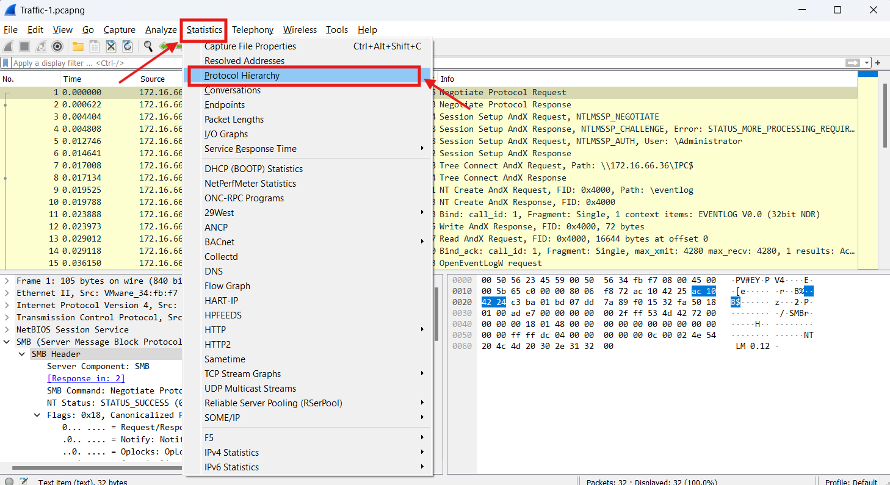
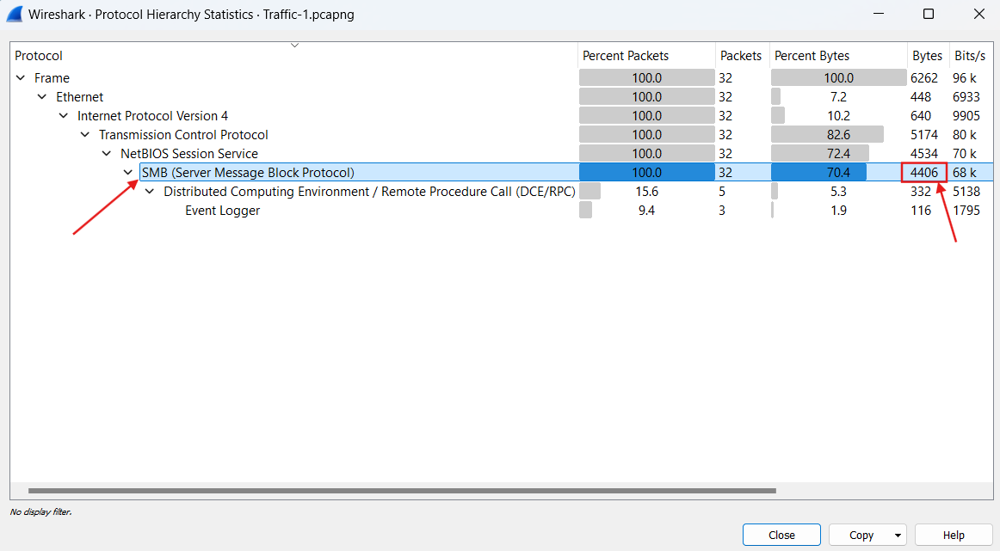
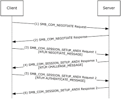
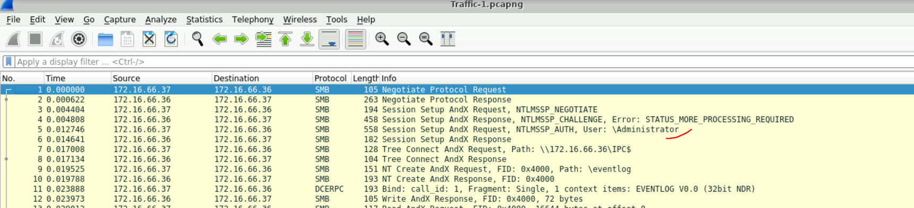
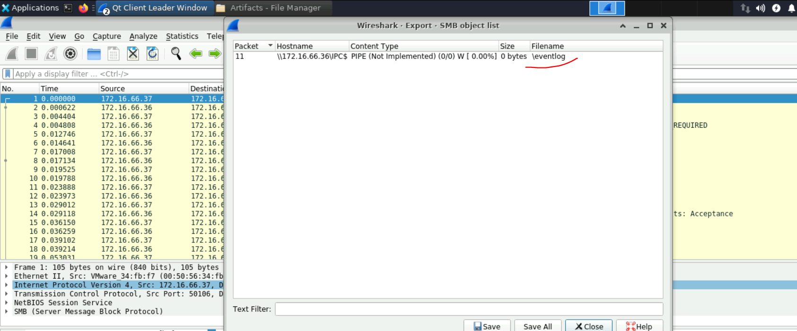
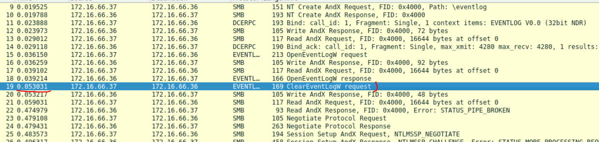
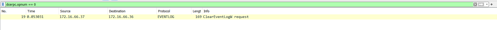

## Link to the Lab : [Open](https://cyberdefenders.org/blueteam-ctf-challenges/packetdetective/)

# Description:
In September 2020, your SOC detected suspicious activity from a user device, flagged by unusual SMB protocol usage. Initial analysis indicates a possible compromise of a privileged account and remote access tool usage by an attacker.

Your task is to examine network traffic in the provided PCAP files to identify key indicators of compromise (IOCs) and gain insights into the attacker’s methods, persistence tactics, and goals. Construct a timeline to better understand the progression of the attack by addressing the following questions.

**Difficulty:** Easy

**Tools:** Wireshark

### Note:
In this lab, we don’t just have a flag to submit; instead, we have Three PCAP files that have a bunch of questions to answer.

# Traffic-1.pcapng

### Question 1:
**The attacker’s activity showed extensive SMB protocol usage, indicating a potential pattern of significant data transfer or file access. What is the total number of bytes of the SMB protocol?**
The question is kind easy if you know a bit about **wireshark**, to determine the total number of bytes of an 'x' protocol you can leverage Wireshark Statistics > Protocol Hierarchy feature.

The answer is : `4406`

### Question 2:
**Authentication through SMB was a critical step in gaining access to the targeted system. Identifying the username used for this authentication will help determine if a privileged account was compromised. Which username was utilized for authentication via SMB?**
First and for a better understanding, we have to understand how smb protocol work to authenticate.

The answer is : `Administrator`
### Question 3:
**During the attack, the adversary accessed certain files. Identifying which files were accessed can reveal the attacker's intent. What is the name of the file that was opened by the attacker?**
To extract files accessed over SMB in Wireshark using the Export Objects feature.

The answer is : `eventlog`

### Question 4:
**Clearing event logs is a common tactic to hide malicious actions and evade detection. Pinpointing the timestamp of this action is essential for building a timeline of the attacker’s behavior. What is the timestamp of the attempt to clear the event log? (24-hour UTC format)**
If you focus on packets and following the flow, you can notice that the eventlog has been cleared and you just have to *change the time format*.

Or you can find the exact packet by filtring:
Key RPC Operations for Analysis:

    Opnum 0 - ClearEventLog: Most significant for investigations, as this action indicates an attempt to erase event logs. By identifying the timestamp of this call, we can mark when the attacker tried to cover their tracks.
    Opnum 7 - ReadEventLog: Useful for checking if the attacker accessed logs before clearing them. Attackers may review logs to verify if their actions were recorded.
    Opnum 1 - BackupEventLog: Relevant if there’s an attempt to back up logs, possibly indicating that the attacker wanted to review or manipulate logs offline.
    Opnum 4 and 5 - GetNumberOfEventLogRecords and GetOldestEventLogRecord: Important for detecting reconnaissance activity, where attackers may be assessing the logs’ size and content before further actions.
To locate the packet with opnum == 0, apply the filter: **dcerpc.opnum == 0**

The answer is : `2020-09-23 16:50:16`

## For Traffic-2 and Traffic-3 i advice you to read the documentation provided by Cyberdefenders itself, it has valuable informations.
[CyberDefenders-WriteUp](https://cyberdefenders.org/blueteam-ctf-challenges/packetdetective/)