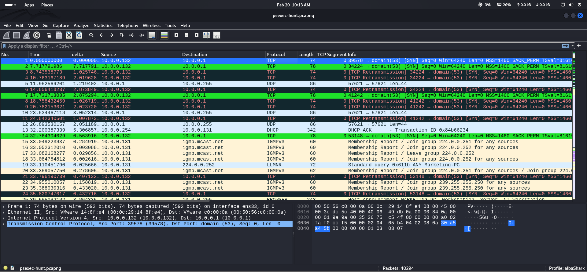
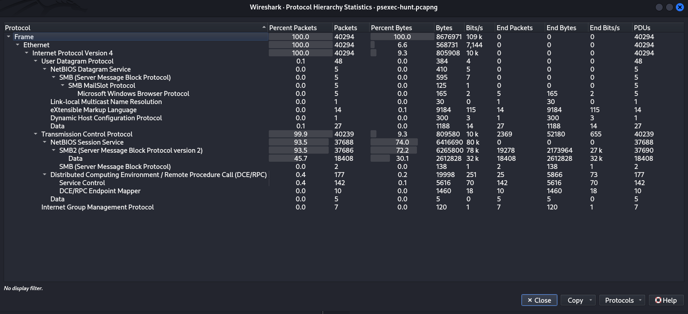
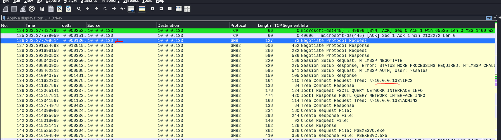
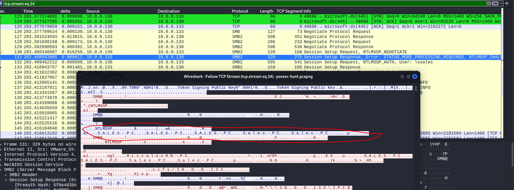
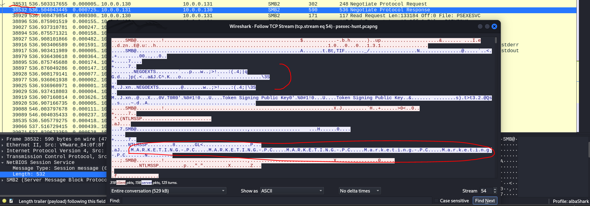

### Link of the lab : [text](https://cyberdefenders.org/blueteam-ctf-challenges/psexec-hunt/)

# Description:
An alert from the Intrusion Detection System (IDS) flagged suspicious lateral movement activity involving PsExec. This indicates potential unauthorized access and movement across the network. As a SOC Analyst, your task is to investigate the provided PCAP file to trace the attacker’s activities. Identify their entry point, the machines targeted, the extent of the breach, and any critical indicators that reveal their tactics and objectives within the compromised environment.

**Difficulty:** Easy

**Tools:** Wireshark

### Note:
In this lab, we don’t just have a flag to submit; instead, we have a bunch of questions to answer.

Before diving into the questions, and from the title, we need to research a bit about **lateral movement using PsExec**. 

In brief, *Lateral Movement* refers to techniques attackers use to move across a network, and one of them is via PsExec.

# Initial Analysis:
Upon opening the packet, we can see that there are 40,294 packets. To get a **big picture** overview of what's happening, we should check the protocol hierarchy and conversations:

  

We notice that SMB2 packets dominate most of the traffic, which makes sense because, as the description mentions, we are dealing with *lateral movement using PsExec*.

---

### Question 1:
**To effectively trace the attacker’s activities within our network, can you identify the IP address of the machine from which the attacker initially gained access?**

From packet 126, we can observe that `10.0.0.130` is sending a request to reach `10.0.0.133`. After several steps, the attacker successfully connects to the hidden `ADMIN$` share, allowing them to create a PsExec version on the target machine.

**The answer is:** `10.0.0.130`

---

### Question 2:
**To fully understand the extent of the breach, can you determine the machine's hostname to which the attacker first pivoted?**

Pivoting refers to *moving from one compromised system to another*. As we saw previously, the attacker moved from PC-A (`10.0.0.130`) to PC-B (`10.0.0.133`). Now we need to find the name of PC-B.

After following the TCP stream, we can see that `Sales-PC` was the target.

**The answer is:** `Sales-PC`

---

### Question 3:
**Knowing the username of the account the attacker used for authentication will give us insights into the extent of the breach. What is the username utilized by the attacker for authentication?**

From packet 132, it’s clear that the attacker attempted to authenticate using the username `ssales`.

**The answer is:** `ssales`

---

### Question 4:
**After figuring out how the attacker moved within our network, we need to know what they did on the target machine. What’s the name of the service executable the attacker set up on the target?**

This entire attack is based on PsExec. From the analysis, the service executable created is:

**The answer is:** `psexesvc`

---

### Question 5:
**We need to know how the attacker installed the service on the compromised machine to understand the attacker's lateral movement tactics. This can help identify other affected systems. Which network share was used by PsExec to install the service on the target machine?**

A network share is **a resource on a local network that can be accessed by others** and is generally written in this format: `\\<ip address>\<name>$`.

When analyzing the packets, we observe the following shares: `\IPC$` and `\ADMIN$`. After research, i found:
- **`ADMIN$`**: Points to the Windows installation directory (usually `C:\Windows`).
- **`IPC$`**: Used for inter-process communication (e.g., for connecting to remote services).

**The answer is:** `ADMIN$`

---

### Question 6:
**Which network share was also utilized for communication?**

From the previous analysis, we see that `IPC$` is also used for communication purposes.

**The answer is:** `IPC$`

---

### Question 7:
**Now that we have a clearer picture of the attacker’s activities on the compromised machine, it’s important to identify any further lateral movement. What is the hostname of the second machine the attacker targeted to pivot within our network?**

After following the packets and scrolling through the data, I noticed the attacker attempting to start another connection with a different machine. Following the TCP stream was key to uncovering the next target.

And yes, the answer is:

**The answer is:** `Marketing-PC`

---

Thanks to CyberDefenders for this amazing challenge . <3
